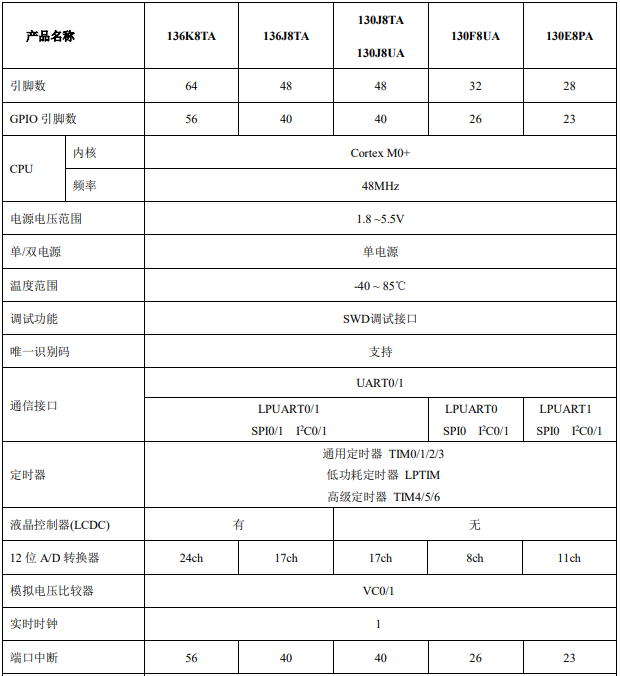
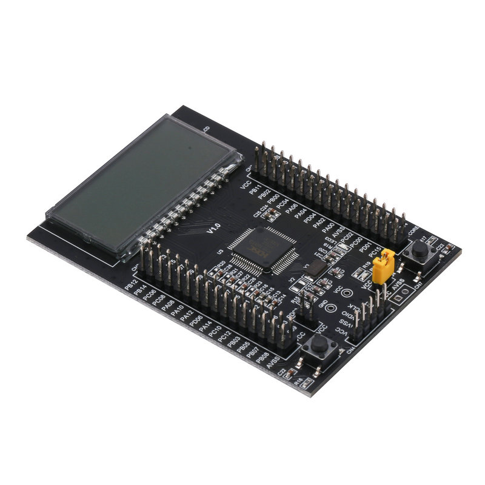

# [HC32L136](https://github.com/SoCXin/HC32L136)

* [hdsc](https://www.hdsc.com.cn/): [Cortex-M0](https://github.com/SoCXin/Cortex)
* [L3R3](https://github.com/SoCXin/Level): 48 MHz x 0.94 DMIPS/MHz, [2.46 CoreMark/MHz](https://www.eembc.org/coremark/scores.php)

## [简介](https://github.com/SoCXin/HC32L136/wiki)

[HC32L136](https://github.com/SoCXin/HC32L136) 集成 12 位 1Msps 高精度 SARADC 以及集成了比较器、运放、内置高性能 PWM 定时
器、LCD 显示、多路 UART、SPI、I2C 等丰富的通讯外设，内建 AES、TRNG 等信息安全模块，具有高整合度、高抗干扰、高可靠性和超低功耗的特点。

### 关键特性

* RTC
* LCD 控制器
* 3 x OPA
* 2 x CMP
* 宽电压1.8 ~5.5V

### [资源收录](https://github.com/SoCXin)

* [参考资源](src/)
* [参考文档](docs/)
* [参考工程](project/)

### [选型建议](https://github.com/SoCXin)

[HC32L136](https://github.com/SoCXin/HC32L136)

* LQFP64（10*10,0.5mm）
* LQFP64（7*7,0.4mm）
* LQFP48（7*7,0.5mm）

#### 相关开发板

### [探索芯世界 www.SoC.xin](http://www.SoC.Xin)
